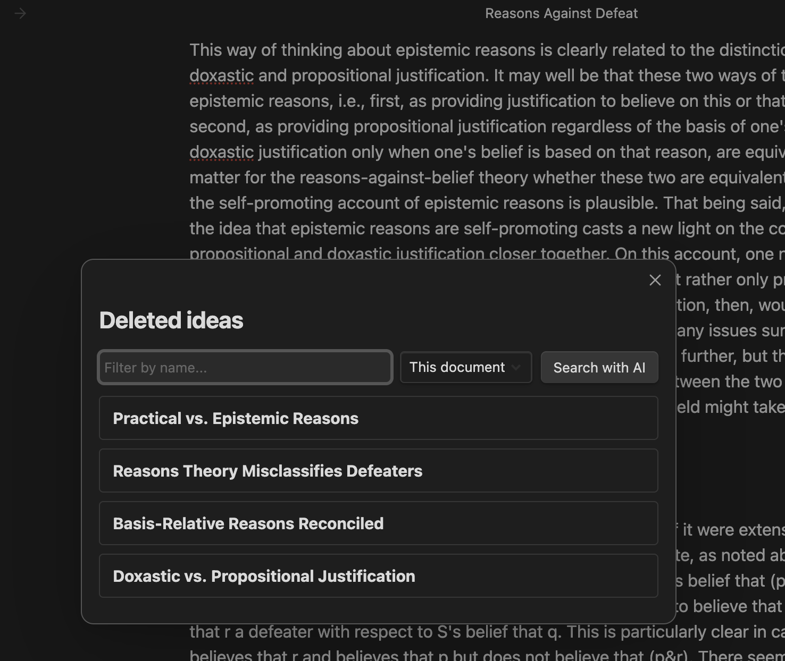

# WriteToReason

An Obsidian plugin for writers who reason by writing — capturing the ideas you delete during drafting so you can recover and reintegrate them later.

## What it does

When you write, you delete. A lot. Some of what you delete is just typo correction. But some of it is good thinking — paragraphs you cut because they didn't fit *here*, but that contained ideas worth keeping. WriteToReason captures those deletions automatically and gives you a way to find them again.

- **Captures deletions** above a configurable word threshold as you write
- **Names each idea** with a pithy 3-5 word title (via Claude)
- **Browse a list** of deleted ideas, filter by name, or search semantically with natural language
- **Reintegrate** in three ways: paste the raw excerpt, paste excerpt + summary, or have Claude write a new passage that integrates the idea at your cursor
- **Search across scope**: current document, current project (top-level folder), or the entire vault. Cross-document search uses embeddings to retrieve the most relevant ideas before sending them to Claude.
- **See related ideas**: each idea card shows links to other semantically similar ideas, so you can navigate between them
- **Clean up**: trash ideas you no longer want; related links update automatically

## Setup

1. Install the plugin (currently manual: clone the repo into `.obsidian/plugins/write-to-reason/`, run `npm install`, then `npm run build`)
2. Enable the plugin in Obsidian's Community Plugins settings
3. Add API keys in plugin settings:
   - **Anthropic API key** (required) — for naming ideas, semantic search, and reintegration
   - **Voyage AI API key** (optional) — for embeddings, only needed if searching across multiple documents

## Usage

- Just write. Deletions above the threshold (default 50 words) are captured automatically.
- Run `WriteToReason: Search deleted ideas` from the command palette.
- The modal opens with a list of named ideas for the current document. Click an idea to expand it; pick a reintegration mode.
- Expanded cards show "Related" links to semantically similar ideas — click to jump between them.
- Use the scope dropdown to widen the search to the project or vault.
- Click "Search with AI" to ask a natural-language question about your deleted ideas.
- Click "Trash" on an expanded card (then "Confirm?") to permanently delete an idea you no longer want.

## Where the data lives

All captured deletions are stored as plain JSON in `.writing-history/deletions.json` inside your vault. Nothing leaves your machine except what's sent to Claude and Voyage when you run a query.

## Status

Personal project, not yet published to the Obsidian community plugin marketplace. The capture, storage, naming, search (single-doc and cross-doc), reintegration, related-idea linking, and trash features are all working. Currently usable day-to-day.

On the roadmap:
- Redundancy detection — collapse near-duplicate iterations of the same idea
- Richer context capture — running outline of the surrounding reasoning, not just nearby characters
- Distribution via the community plugin marketplace
- Archiving / decay for long-running projects

## Built with

- TypeScript
- Obsidian plugin API + CodeMirror 6
- Anthropic Claude (Sonnet) for naming, search, integration
- Voyage AI for embeddings
